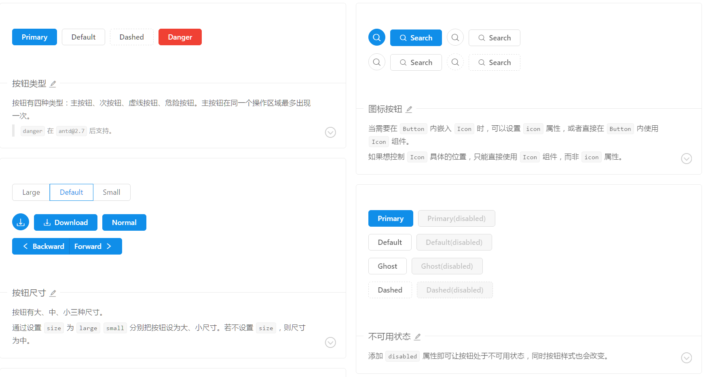
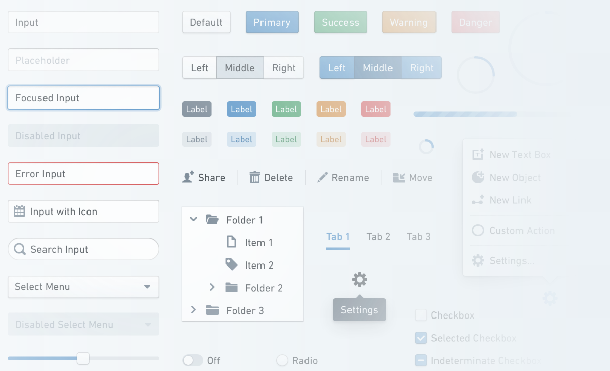
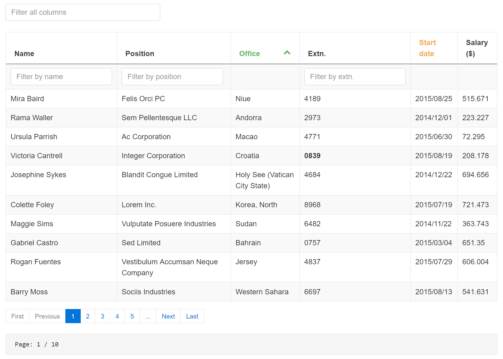
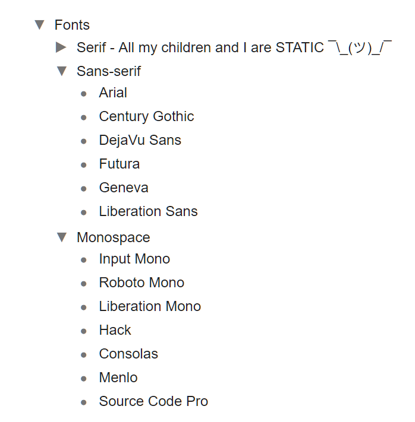
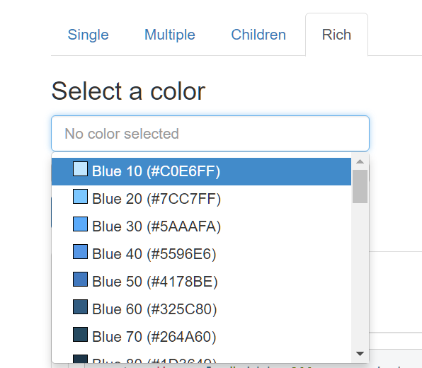
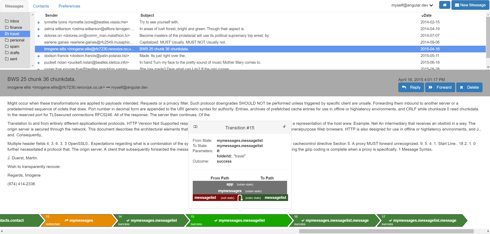

# awesome-typescript-projects [](https://github.com/sindresorhus/awesome)
awesome typescript open source projects.

## Contributing

Please take a quick look at the [contribution guidelines](/contributing.md) first. If you see a package or project here that is no longer maintained or is not a good fit, please submit a pull request to improve this file, Thanks.

## TypeScript

### <font color='00A2E8'>**>>>[TypeScript](https://github.com/Microsoft/TypeScript) - TypeScript is a superset of JavaScript that compiles to clean JavaScript output.**</font>

TypeScript is a language for application-scale JavaScript. TypeScript adds optional types, classes, and modules to JavaScript. TypeScript supports tools for large-scale JavaScript applications for any browser, for any host, on any OS. TypeScript compiles to readable, standards-based JavaScript.

### <font color='00A2E8'>**>>>[DefinitelyTyped](https://github.com/DefinitelyTyped/DefinitelyTyped) - for high quality TypeScript type definitions**</font>

-----


## Learning Resources

### <font color='00A2E8'>**>>>[TypeScript-Handbook](https://github.com/Microsoft/TypeScript-Handbook) - The TypeScript Handbook is a comprehensive guide to the TypeScript language**</font>

### <font color='00A2E8'>**>>>[typescript-book](https://github.com/basarat/typescript-book) - The definitive guide to TypeScript and possibly the best TypeScript book**</font>

### <font color='00A2E8'>**>>>[design_patterns_in_typescript](https://github.com/torokmark/design_patterns_in_typescript) - Here are the implementations of the following design patterns in TypeScript**</font>

### <font color='00A2E8'>**>>>[TypeScriptSamples](https://github.com/Microsoft/TypeScriptSamples) - Samples for TypeScript**</font>

### <font color='00A2E8'>**>>>[angular-styleguide](https://github.com/toddmotto/angular-styleguide) - AngularJS styleguide for teams**</font>

### <font color='00A2E8'>**>>>[angular2-education](https://github.com/timjacobi/angular2-education) - A list of helpful material to develop using Angular**</font>

### <font color='00A2E8'>**>>>[angular2typescript](https://github.com/Farata/angular2typescript) - Code samples from the book Angular 2 Development with TypeScript**</font>

### <font color='00A2E8'>**>>>[todomvc-redux-react-typescript](https://github.com/jaysoo/todomvc-redux-react-typescript) - TodoMVC example using Redux, React, and Typescript**</font>

-----


## IDE

### <font color='00A2E8'>**>>>[vscode](https://github.com/Microsoft/vscode) - The best open source IDE**</font>

[https://github.com/Microsoft/vscode](https://github.com/Microsoft/vscode)

VS Code is a new type of tool that combines the simplicity of a code editor with what developers need for their core edit-build-debug cycle. Code provides comprehensive editing and debugging support, an extensibility model, and lightweight integration with existing tools.


### <font color='00A2E8'>**>>>[monaco-editor](https://github.com/Microsoft/monaco-editor) - A browser based code editor**</font>

[https://github.com/Microsoft/monaco-editor](https://github.com/Microsoft/monaco-editor)

The Monaco Editor is the code editor that powers VS Code.

[Demo page](https://microsoft.github.io/monaco-editor/)


### <font color='00A2E8'>**>>>[ALM](https://github.com/alm-tools/alm) - The best IDE for TypeScript**</font>

[https://github.com/alm-tools/alm](https://github.com/alm-tools/alm)

With great languages come great development tools.


### <font color='00A2E8'>**>>>[superpowers](https://github.com/superpowers/superpowers-core) - Extensible HTML5 app for real-time collaborative projects**</font>

[https://github.com/superpowers/superpowers-core](https://github.com/superpowers/superpowers-core)

Superpowers is a downloadable HTML5 app. You can use it solo like a regular offline game maker, or setup a password and let friends join in on your project through their Web browser. It's great for working together over long periods of time, for jamming over a weekend, or just for helping each other out with debugging!


### <font color='00A2E8'>**>>>[eve](https://github.com/witheve/eve) - Better tools for thought**</font>

[https://github.com/witheve/eve](https://github.com/witheve/eve)

Eve is a programming language and IDE based on years of research into building a human-first programming platform. You can play with Eve online here: [play.witheve.com](http://play.witheve.com/).

[](http://play.witheve.com/#/examples/flappy.eve)


### <font color='00A2E8'>**>>>[cats](https://github.com/jbaron/cats) - Code Assistant for TypeScript**</font>

[https://github.com/jbaron/cats](https://github.com/jbaron/cats)

CATS is an IDE for TypeScript and Web developers. CATS is open source software released under the Apache 2.0 license and runs on Linux, Windows and OS X. CATS itself is also written in TypeScript, so you can easily customize it to your needs if required.


-----


## Framework 

### <font color='00A2E8'>**>>>[angular](https://github.com/angular/angular) - One framework. Mobile & desktop.**</font>

[https://github.com/angular/angular](https://github.com/angular/angular)

Angular is a development platform for building mobile and desktop web applications using Typescript/JavaScript (JS) and other languages.


### <font color='00A2E8'>**>>>[ng2-admin](https://github.com/akveo/ng2-admin) - Angular 2 admin dashboard framework**</font>

[https://github.com/akveo/ng2-admin](https://github.com/akveo/ng2-admin)

Admin panel framework based on Angular 2, Bootstrap 4 and Webpack.

[Demo Page](http://akveo.com/ng2-admin/)


### <font color='00A2E8'>**>>>[angular-seed](https://github.com/mgechev/angular-seed) - Extensible, reliable and modular starter project for Angular 2 (and beyond) with statically typed build and AoT compilation**</font>

[https://github.com/mgechev/angular-seed](https://github.com/mgechev/angular-seed)

Provides fast, reliable and extensible starter for the development of Angular projects.


### <font color='00A2E8'>**>>>[NativeScript](https://github.com/NativeScript/NativeScript) - NativeScript is an open source framework for building truly native mobile apps with JavaScript. Use web skills, like Angular, FlexBox and CSS, and get native UI and performance on iOS and Android**</font>

[https://github.com/NativeScript/NativeScript](https://github.com/NativeScript/NativeScript)

NativeScript provides a best-of-both-worlds development experience. Our cross-platform JavaScript modules give you the convenience of writing iOS and Android apps from a single JavaScript codebase, while our runtimes give you the power of accessing native APIs, SDKs, and frameworks when you need them—all without needing to open Xcode or Android Studio. NativeScript was created and is supported by Telerik.

*Mobile Case:*


### <font color='00A2E8'>**>>>[ionic](https://github.com/driftyco/ionic) - Build amazing native and progressive web apps with Angular and open web technologies. One app running on everything**</font>

[https://github.com/driftyco/ionic](https://github.com/driftyco/ionic)

Ionic is the open-source mobile app development framework that makes it easy to build top quality native and progressive web apps with web technologies.
Ionic is based on Angular and comes with many significant performance, usability, and feature improvements over the past versions.

*Mobile Case:*


### <font color='00A2E8'>**>>>[ionic-native](https://github.com/driftyco/ionic-native) - Native features for mobile apps built with Cordova/PhoneGap and open web technologies.**</font>

[https://github.com/driftyco/ionic-native](https://github.com/driftyco/ionic-native)

Ionic Native is a curated set of wrappers for Cordova plugins that make adding any native functionality you need to your Ionic, Cordova, or Web View mobile app easy.


### <font color='00A2E8'>**>>>[egret](https://github.com/egret-labs/egret-core) - Egret is a brand new open mobile game and application engine which allows you to quickly build mobile games and apps on Android,iOS and Windows.**</font>

[https://github.com/egret-labs/egret-core](https://github.com/egret-labs/egret-core)

Developed by Egret Technology, Egret Engine 4.0 includes a newly built 3D engine and a 2D engine created based on HTML5. With its robust cross-platform operability and commitment to solving the performance and fragmentation problems of HTML5 APP and games, Egret Engine 4.0 will perfectly meet developers’ needs. 

*Game Case:*


### <font color='00A2E8'>**>>>[AtomicGameEngine](https://github.com/AtomicGameEngine/AtomicGameEngine) - The Atomic Game Engine is a multi-platform 2D and 3D engine with a consistent API in C#, JavaScript, TypeScript, and C++**</font>

[https://github.com/AtomicGameEngine/AtomicGameEngine](https://github.com/AtomicGameEngine/AtomicGameEngine)

The Atomic Game Engine is powerful 2D/3D technology developed by industry veterans and contributors from around the world.

Atomic is lean, full source, technology for mobile and desktop. It has a powerful core API with access to raw, down to the metal, native performance. Atomic technology leverages industry standard languages and tooling for use in games, education/training, serious applications, and new growth areas such as AR/VR.


### <font color='00A2E8'>**>>>[Babylon.js](https://github.com/BabylonJS/Babylon.js) - a complete JavaScript framework for building 3D games with HTML 5 and WebGL**</font>

[https://github.com/BabylonJS/Babylon.js](https://github.com/BabylonJS/Babylon.js)

Getting started? Play directly with the Babylon.js API via our [playground](http://www.babylonjs.com/playground). It contains also lot of simple samples to learn how to use it. 


### <font color='00A2E8'>**>>>[cyclejs](https://github.com/cyclejs/cyclejs) - A functional and reactive JavaScript framework for predictable code**</font>

[https://github.com/cyclejs/cyclejs](https://github.com/cyclejs/cyclejs)

Cycle’s core abstraction is your application as a pure function main() where inputs are read effects (sources) from the external world and outputs (sinks) are write effects to affect the external world. These I/O effects in the external world are managed by drivers: plugins that handle DOM effects, HTTP effects, etc.

```ts
function main(sources) {
  const decrement$ = sources.DOM
    .select('.decrement').events('click').mapTo(-1);

  const increment$ = sources.DOM
    .select('.increment').events('click').mapTo(+1);

  const action$ = xs.merge(decrement$, increment$);
  const count$ = action$.fold((x, y) => x + y, 0);

  const vtree$ = count$.map(count =>
    div([
      button('.decrement', 'Decrement'),
      button('.increment', 'Increment'),
      p('Counter: ' + count)
    ])
  );
  return { DOM: vtree$ };
}
```


### <font color='00A2E8'>**>>>[angular-seed-advanced](https://github.com/NathanWalker/angular-seed-advanced) - An advanced Angular seed project with support for ngrx/store, ngrx/effects, ngx-translate, angulartics2, lodash, NativeScript (*native* mobile), Electron (Mac, Windows and Linux desktop) and more.**</font>

[https://github.com/NathanWalker/angular-seed-advanced](https://github.com/NathanWalker/angular-seed-advanced)


-----


## UI

### <font color='00A2E8'>**>>>[material2](https://github.com/angular/material2) - Material Design components for Angular**</font>

[https://github.com/angular/material2](https://github.com/angular/material2)

Our goal is to build a set of high-quality UI components built with Angular and TypeScript, following the Material Design spec. These components will serve as an example of how to write Angular code following best practices.


### <font color='00A2E8'>**>>>[ant-design](https://github.com/ant-design/ant-design) - A UI Design Language**</font>

[https://github.com/ant-design/ant-design](https://github.com/ant-design/ant-design)

An enterprise-class UI design language and React-based implementation.




### <font color='00A2E8'>**>>>[ant-design-mobile](https://github.com/ant-design/ant-design-mobile) - A configurable Mobile UI**</font>

[https://github.com/ant-design/ant-design-mobile](https://github.com/ant-design/ant-design-mobile)

A configurable Mobile UI specification and React-based implementation.


### <font color='00A2E8'>**>>>[blueprint](https://github.com/palantir/blueprint) - A React-based UI toolkit for the web**</font>

[https://github.com/palantir/blueprint](https://github.com/palantir/blueprint)

It is optimized for building complex, data-dense web interfaces for desktop applications. If you rely heavily on mobile interactions and are looking for a mobile-first UI toolkit, this may not be for you.




### <font color='00A2E8'>**>>>[plottable](https://github.com/palantir/plottable) - A library of modular chart components built on D3**</font>

[https://github.com/palantir/plottable](https://github.com/palantir/plottable)

It's easier to quickly build charts than with D3, and the charts are much more flexible than standard-template charts provided by charting libraries.


### <font color='00A2E8'>**>>>[ng2-bootstrap](https://github.com/valor-software/ng2-bootstrap) - Native Angular directives for Bootstrap**</font>

[https://github.com/valor-software/ng2-bootstrap](https://github.com/valor-software/ng2-bootstrap)

ng2-bootstrap contains all core (and not only) Bootstrap components powered by Angular 2. So you don't need to include original JS components, but we are using markup and css provided by Bootstrap.


### <font color='00A2E8'>**>>>[ng2-charts](https://github.com/valor-software/ng2-charts) - Beautiful charts for Angular2 based on Chart.js**</font>

[https://github.com/valor-software/ng2-charts](https://github.com/valor-software/ng2-charts)

There are one directive for all chart types: base-chart, and there are 6 types of charts: , line, bar, radar, pie, polarArea, doughnut.


### <font color='00A2E8'>**>>>[ng2-handsontable](https://github.com/valor-software/ng2-handsontable) - Angular 2 directive for Handsontable**</font>

[https://github.com/valor-software/ng2-handsontable](https://github.com/valor-software/ng2-handsontable)

Handsontable is a data grid component with an Excel-like appearance. Built in JavaScript, it integrates with any data source and comes with features like data validation, sorting, grouping, data binding or column ordering.


### <font color='00A2E8'>**>>>[ng2-table](https://github.com/valor-software/ng2-table) - Simple table extension with sorting, filtering, paging... for Angular2 apps**</font>

[https://github.com/valor-software/ng2-table](https://github.com/valor-software/ng2-table)

[Demo Page](http://valor-software.com/ng2-table/)




### <font color='00A2E8'>**>>>[ng2-tree](https://github.com/valor-software/ng2-tree) - Angular tree component. VERSION 2.0.0 is still an ALPHA!**</font>

[https://github.com/valor-software/ng2-tree](https://github.com/valor-software/ng2-tree)

[Demo Page](http://valor-software.com/ng2-tree/)




### <font color='00A2E8'>**>>>[ng2-select](https://github.com/valor-software/ng2-select) - Angular2 based replacement for select boxes**</font>

[https://github.com/valor-software/ng2-select](https://github.com/valor-software/ng2-select)

[Demo Page](http://valor-software.com/ng2-select/)




### <font color='00A2E8'>**>>>[primeng](https://github.com/primefaces/primeng) - UI Components for Angular 2**</font>

[https://github.com/primefaces/primeng](https://github.com/primefaces/primeng)

It's easier to quickly build charts than with D3, and the charts are much more flexible than standard-template charts provided by charting libraries.


### <font color='00A2E8'>**>>>[line-chart](https://github.com/n3-charts/line-chart) - Awesome charts for AngularJS**</font>

[https://github.com/n3-charts/line-chart](https://github.com/n3-charts/line-chart)

n3-line-chart is an easy-to-use JavaScript library for creating beautiful charts in AngularJS applications and it is built on top of D3.js.


### <font color='00A2E8'>**>>>[pie-chart](https://github.com/n3-charts/pie-chart) - Yummy pies and donuts for AngularJS**</font>

[https://github.com/n3-charts/pie-chart](https://github.com/n3-charts/pie-chart)

Yummy pies and donuts for AngularJS applications. Built on top of the wonderful D3.js library.


### <font color='00A2E8'>**>>>[trNgGrid](https://github.com/MoonStorm/trNgGrid) - A feature rich Angular grid using standard HTML tables.**</font>

[https://github.com/MoonStorm/trNgGrid](https://github.com/MoonStorm/trNgGrid)

trNgGrid can be used for simple to mildly complex scenarios where you quickly need a data grid with a decent amount of features, which is easy to learn and to hook up with your data models thanks to its powerful data binding properties. All the configuration parameters can be set directly inside the view, hence you won't muddy your Angular scopes or controllers with configuration details.


-----


## Library

### <font color='00A2E8'>**>>>[ui-router](https://github.com/angular-ui/ui-router) - The de-facto solution to flexible routing with nested views in AngularJS**</font>

[https://github.com/angular-ui/ui-router](https://github.com/angular-ui/ui-router)

UI-Router applications are modeled as a hierarchical tree of states. UI-Router provides a state machine to manage the transitions between those application states in a transaction-like manner.




### <font color='00A2E8'>**>>>[mobx](https://github.com/mobxjs/mobx) - Simple, scalable state management.**</font>

[https://github.com/mobxjs/mobx](https://github.com/mobxjs/mobx)

MobX is a battle tested library that makes state management simple and scalable by transparently applying functional reactive programming (TFRP).
The philosophy behind MobX is very simple:

_Anything that can be derived from the application state, should be derived. Automatically._

which includes the UI, data serialization, server communication, etc.


React and MobX together are a powerful combination. React renders the application state by providing mechanisms to translate it into a tree of renderable components. MobX provides the mechanism to store and update the application state that React then uses.

Both React and MobX provide very optimal and unique solutions to common problems in application development. React provides mechanisms to optimally render UI by using a virtual DOM that reduces the number of costly DOM mutations. MobX provides mechanisms to optimally synchronize application state with your React components by using a reactive virtual dependency state graph that is only updated when strictly needed and is never stale.


### <font color='00A2E8'>**>>>[stryker](https://github.com/stryker-mutator/stryker) - The extendable JavaScript mutation testing framework.**</font>

[https://github.com/stryker-mutator/stryker](https://github.com/stryker-mutator/stryker)

Professor X: For someone who hates mutants... you certainly keep some strange company.
William Stryker: Oh, they serve their purpose... as long as they can be controlled.


### <font color='00A2E8'>**>>>[typeorm](https://github.com/typeorm/typeorm) - Data-Mapper ORM for TypeScript and JavaScript (ES7, ES6, ES5). Supports MySQL, PostgreSQL, MariaDB, SQLite, MS SQL Server, Oracle, WebSQL databases. Works in Node.js and Browser.**</font>

[https://github.com/typeorm/typeorm](https://github.com/typeorm/typeorm)

TypeORM is an Object Relational Mapper (ORM) for node.js written in TypeScript that can be used with TypeScript or JavaScript (ES5, ES6, ES7). Its goal to always support latest JavaScript features and provide features that help you to develop any kind of applications that use database - from small applications with a few tables to large scale enterprise applications.

```ts
import {Entity, Column, PrimaryGeneratedColumn, OneToOne, JoinColumn} from "typeorm";
import {Photo} from "./Photo";

@Entity()
export class PhotoMetadata {

    @PrimaryGeneratedColumn()
    id: number;

    @Column("int")
    height: number;

    @Column("int")
    width: number;

    @Column()
    orientation: string;

    @Column()
    compressed: boolean;

    @Column()
    comment: string;

    @OneToOne(type => Photo)
    @JoinColumn()
    photo: Photo;
}
```


### <font color='00A2E8'>**>>>[reflect-metadata](https://github.com/rbuckton/reflect-metadata) - Prototype for a Metadata Reflection API for ECMAScript**</font>

[https://github.com/rbuckton/reflect-metadata](https://github.com/rbuckton/reflect-metadata)

Proposal to add Decorators to ES7, along with a prototype for an ES7 Reflection API for Decorator Metadata.


### <font color='00A2E8'>**>>>[apollo-client](https://github.com/apollographql/apollo-client) - A fully-featured caching GraphQL client for any server or UI framework**</font>

[https://github.com/apollographql/apollo-client](https://github.com/apollographql/apollo-client)

Apollo Client can be used in any JavaScript frontend where you want to use data from a GraphQL server.


### <font color='00A2E8'>**>>>[postgraphql](https://github.com/calebmer/postgraphql) - A GraphQL API created by reflection over a PostgreSQL schema.**</font>

[https://github.com/calebmer/postgraphql](https://github.com/calebmer/postgraphql)

With PostGraphQL, you can access the power of PostgreSQL through a well designed GraphQL server. PostGraphQL uses PostgreSQL reflection APIs to automatically detect primary keys, relationships, types, comments, and more providing a GraphQL server that is highly intelligent about your data.


### <font color='00A2E8'>**>>>[InversifyJS](https://github.com/inversify/InversifyJS) - An isomorphic dependency injection library.**</font>

InversifyJS is an inversion of control library that works in both front-end and
back-end applications. InversifyJS is framework agnostic and can be integrated with
many existing frameworks like React applications powered by MobX or Node.js
applications powered by express.

InversifyJS is particularly well integrated with Express thanks to the
[inversify-express-utils](https://github.com/inversify/inversify-express-utils) project:

```ts
import * as express from "express";
import { Response, RequestParams, Controller, Get, Post, Put } from "inversify-express-utils";
import { injectable, inject } from "inversify";
import { interfaces } from "./interfaces";
import { Type } from "./types";

@injectable()
@Controller("/api/user")
class UserController {

    @inject(Type.UserRepository) private readonly _userRepository: interfaces.UserRepository,
    @inject(Type.Logger) private readonly _logger: interfaces.Logger

    @Get("/")
    public async get(
      @Request() req: express.Request,
      @Response() res: express.Response
    ) {
        try {
            this._logger.info(`HTTP ${req.method} ${req.url}`);
            return await this._userRepository.readAll();
        } catch (e) {
            this._logger.error(`HTTP ERROR ${req.method} ${req.url}`, e);
            res.status(500).json([]);
        }
    }

    @Get("/:email")
    public async getByEmail(
      @RequestParams("email") email: string,
      @Request() req: express.Request,
      @Response() res: express.Response
    ) {
        try {
            this._logger.info(`HTTP ${req.method} ${req.url}`);
            return await this._userRepository.readAll({ where: { email: email } });
        } catch (e) {
            this._logger.error(`HTTP ERROR ${req.method} ${req.url}`, e);
            res.status(500).json([]);
        }
    }

}
```

The [Inversify GitHub organization](https://github.com/inversify)
also provides the community with some helpers and examples to facilitate the integration of InversifyJS with other popular projects.


### <font color='00A2E8'>**>>>[create-react-app-typescript](https://github.com/wmonk/create-react-app-typescript) - Create React apps using typescript with no build configuration.**</font>

[https://github.com/wmonk/create-react-app-typescript](https://github.com/wmonk/create-react-app-typescript)

Create React apps (with Typescript) with no build configuration.

Do you know react and want to try out typescript? Or do you know typescript and want to try out react? Get all the benefits from create-react-app but you use typescript!


### <font color='00A2E8'>**>>>[ReactXP](https://github.com/microsoft/reactxp) - ReactXP is a library for cross-platform app development using React and React Native.**</font>

[https://github.com/microsoft/reactxp](https://github.com/microsoft/reactxp)

With React and React Native, your web app can share most its logic with your iOS and Android apps, but the view layer needs to be implemented separately for each platform. We have taken this a step further and developed a thin cross-platform layer we call ReactXP. If you write your app to this abstraction, you can share your view definitions, styles and animations across multiple target platforms. Of course, you can still provide platform-specific UI variants, but this can be done selectively where desired.


### <font color='00A2E8'>**>>>[json-schema-to-typescript](https://github.com/bcherny/json-schema-to-typescript) - Compile JSONSchema to TypeScript typings.**</font>

[https://github.com/bcherny/json-schema-to-typescript](https://github.com/bcherny/json-schema-to-typescript)

--------

## Application

### **>>>[Hitchhiker](https://github.com/brookshi/Hitchhiker) - Hitchhiker Api is a Restful Api integrated testing tool that support Schedule, Response comparsion, Stress Test etc. You can deploy it in your local server. It make easier to manage Api with your team.**

* Api collaboration development with team
* Api history
* Multiple environments and Runtime variables support, easy to handle api dependence
* Request parameterization, include ManytoMany and OnetoOne, now you can use a request to handle multple situation like various query string, body
* Schedule and run batch
* Make a comparison for Api response between two different environments (eg: stage vs product)
* Support Handling response before comparing
* Easy to deploy (support docker, windows, linux), keep data in your control, never lose data
* All changed will be auto saved in local cache even if refresh page
* Support importing Postman v1 collections
* Distributed stress test
* Api Document (in future)


### **>>>[upterm](https://github.com/railsware/upterm) - Upterm (formerly Black Screen) is an IDE in the world of terminals. Strictly speaking, it's both a terminal emulator and an interactive shell based on Electron.**

1. Autocompletion
Upterm shows the autocompletion box as you type and tries to be smart about what to suggest. Often you can find useful additional information on the right side of the autocompletion, e.g. expanded alias value, command descriptions, value of the previous directory (cd -), etc.

2. Compatibility
All command-line programs (including emacs, ssh and vim) should work as expected. 


